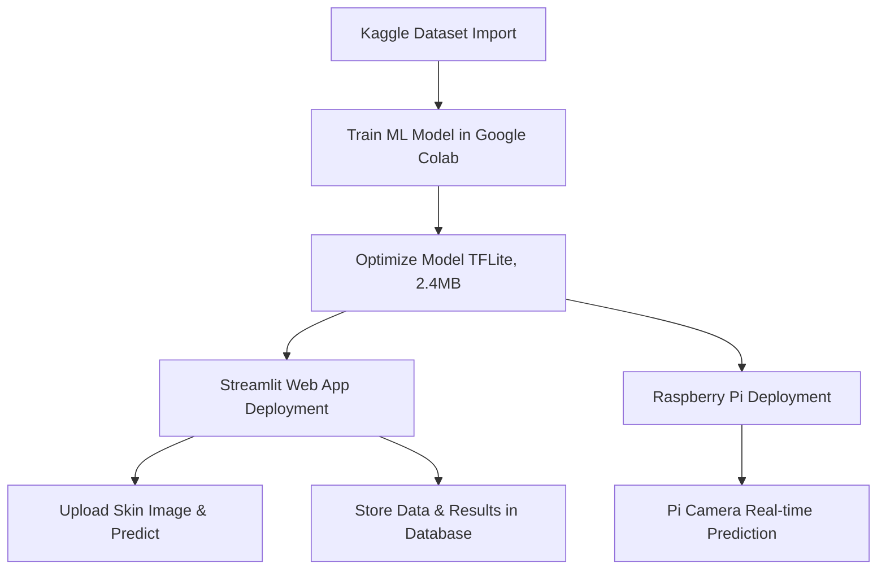
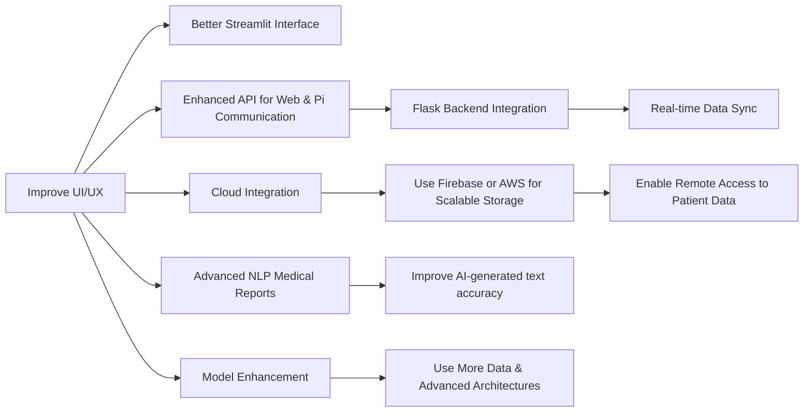

# 🌟 Skin Disease Classification & Prediction

## 🏥 Introduction
This project aims to classify **skin diseases into 8 types** using a machine learning model trained on a **Kaggle dataset**. The trained model is deployed in two ways:
- 🌐 **Streamlit Web App** – Users can **upload skin images** to predict disease type.
- 📷 **Raspberry Pi 4B Device** – Uses a **camera for real-time prediction**, displaying results on the device.

## 🛠️ Tools & Technologies Used
- 🤖 **Machine Learning**: TensorFlow, Keras, Transfer Learning (**EfficientNet, MobileNet**)
- 🔧 **Model Optimization**: TensorFlow Lite (**TFLite, 2.4MB model**)
- 🌍 **Web Development**: Streamlit, Flask (for API backend)
- 🗄️ **Database**: SQLite / PostgreSQL (for storing patient data)
- 📡 **Cloud & Data Handling**: Google Colab, Kaggle API
- 🏗 **Hardware**: Raspberry Pi 4B, Pi Camera
- 📝 **NLP**: AI-based text generation for **medical report creation**

## 📌 Workflow Diagram

## 🚀 Features
✅ **High Accuracy**: Near **100% accuracy** using deep learning.  
✅ **Optimized Model**: Efficient **2.4MB TensorFlow Lite model** for embedded devices.  
✅ **Dual Deployment**: Available on **web (Streamlit) & Raspberry Pi (real-time detection)**.  
✅ **Admin Panel**: Stores patient **images, predictions, and IDs**.  
✅ **NLP Medical Report Generation**: Uses **patient data & AI-generated analysis**.  
✅ **Database Connectivity**: Stores and retrieves **patient history**.  

## 🔮 Future Enhancements

## 📥 Installation & Usage
1️⃣ **Model Training**: 
   - Train in **Google Colab** using the **Kaggle dataset**.
   - Convert the trained model to **TFLite (2.4MB)**.
2️⃣ **Web App Deployment**:
   - Install dependencies: `pip install streamlit tensorflow flask`
   - Run the app: `streamlit run app.py`
3️⃣ **Raspberry Pi Deployment**:
   - Load **TFLite model** onto **Raspberry Pi**.
   - Use **Pi Camera for live skin disease detection**.
4️⃣ **Database Setup**:
   - Configure **SQLite/PostgreSQL** for patient data storage.
5️⃣ **NLP Report Generation**:
   - Implement **AI-generated medical reports**.

## 🎯 Conclusion
This project enhances **healthcare by providing fast & accurate skin disease detection**, enabling **doctors to analyze patient data efficiently**. Future improvements focus on **better scalability, cloud integration, and real-time medical diagnostics**. 🚀

